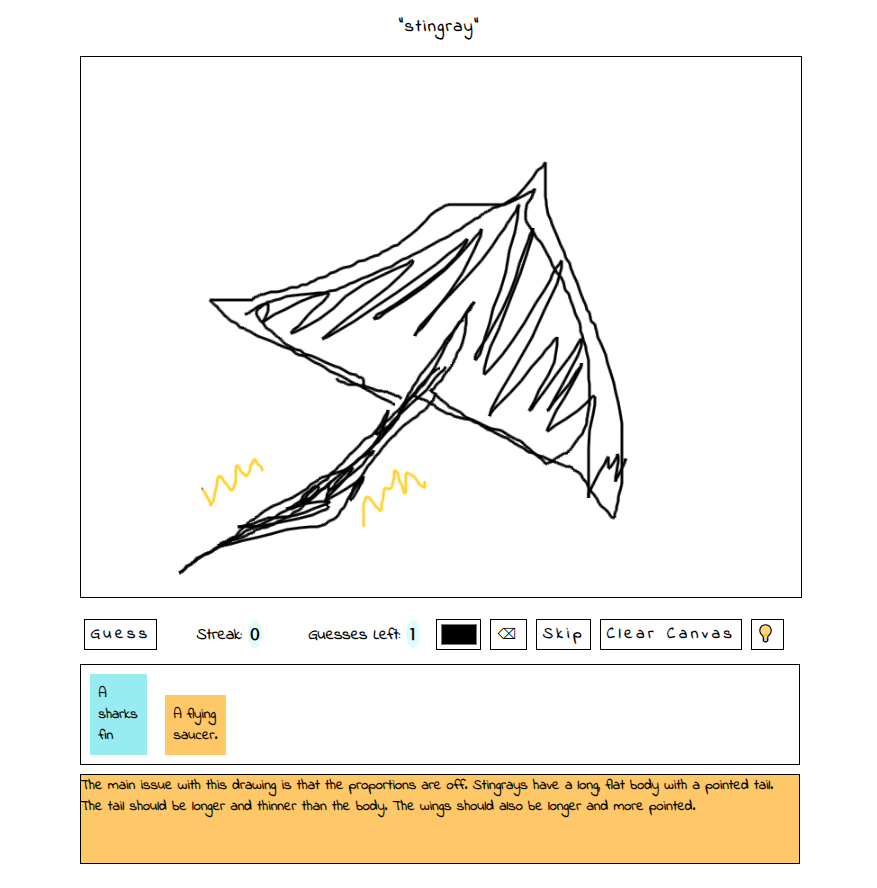
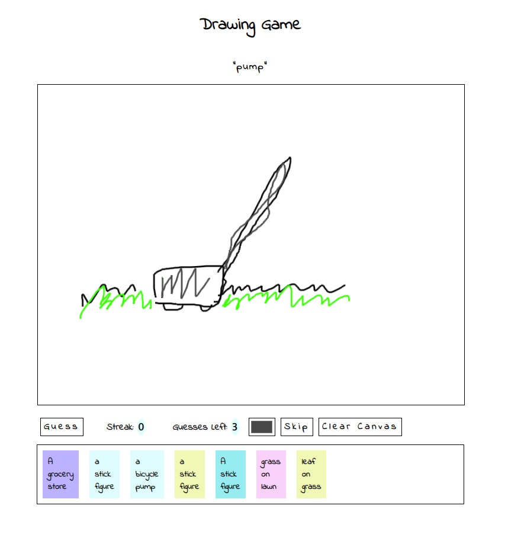

# ai_drawing_guesser

To run this game you need to

1. get an API key from google [here](https://ai.google.dev/?gad_source=1&gclid=CjwKCAjw3NyxBhBmEiwAyofDYb2Ia37ykQW3aUUrP2oOpif2-ronMugbEN0lrY8ZjF6QBwgNZtJEdRoCzSsQAvD_BwE)
2. update the .env file see [example.env](example.env)
3. run the following command to start the project

```
pip install -r requirements.txt
```

To start the app
```
python3 app.py
```
Go to [http://localhost:5000/](http://localhost:5000/) to see your app live.

Have fun

